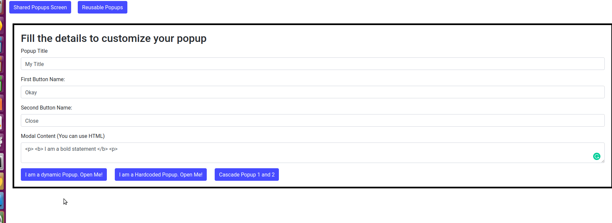
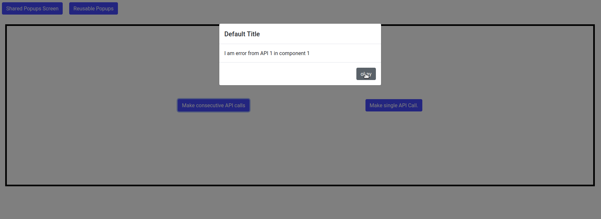

# AngularLabs

Angular Labs will contain small angular projects or POC covering wide varieties of anuglar topics, component development , RxJS, and best practices in front end development. 

Each Lab will be a seperate branch on git. You can access any lab through it's **branch name** as `git checkout <branch_name>`.

<!-- ### Lab 1 - Logging, Caching in Angular using Interceptors
* Branch name - lab1
* Details - In this lab, 
  * created Logging Interceptor, 
  * created caching interceptor with different strategies. 
  * Also saw how to convert `one and done` http observable to multi valued observable.

### Lab 2 - Playing with rxjs operators and observables
* Branch name - lab2
* Details - In this lab, worked with tap, finally, map, of, startWith, mergeMap and difference with map.
   * Compared mergeMap, switchMap and concatMap

### Lab 4 - Leaking components demo and how to prevent leak
* Branch name - lab4
* In this lab, created a leaking component
  Prevent the leak through unsubscribe, take(1), and takeUntil operators.

### Lab 6 - Subjects and Observables
* Branch name - lab6
* In this lab, understood observer pattern, Observables and Subject.
   * How they are different?
   * Different types of subjects
   * ReplaySubject, AsyncSubject, BehavourSubject and Subject. -->

<!--  -->
<link rel="stylesheet" href="https://stackpath.bootstrapcdn.com/bootstrap/4.3.1/css/bootstrap.min.css" integrity="sha384-ggOyR0iXCbMQv3Xipma34MD+dH/1fQ784/j6cY/iJTQUOhcWr7x9JvoRxT2MZw1T" crossorigin="anonymous">

---

## Polling an API
* In this lab, I created an API endpoint polling mechanism using RxJS.
* This may be required for multiple use cases such as showing the spinner till the desired result is received, showing
stream of data etc.
* You can read about it on [medium](https://medium.com/@mohitkumar_72140/rxjs-how-to-poll-an-api-be6f2ed3a755) and see demo on [stackblitz](https://stackblitz.com/github/emkay-git/angular-labs/tree/lab8?file=src%2Fapp%2Floader%2Floader.component.ts)
* Source code is in branch [lab8](https://github.com/emkay-git/angular-labs/tree/lab8) or download
it on local as   `git clone https://github.com/emkay-git/angular-labs.git && git checkout lab8`

  
  <em >
Polling an API for required response
</em>

---

## Angular Modal
* In this lab, I augmented the bootstrap Modal through Angular using Angular service and i/o bindings, RxJS' Subjects. It's a two part series.
* Modals are one of the most common UI components which is required in every Front end application for displaying information, error messages, alerts etc.
Now there can be two ways one can use modals in angular, 
  * For every component there is one modal, shown in part I of this series.  
  * Centralized modal managed by service available, to all components. This will be evident in Part II of the series.

#### Part I - Resuable Angular Modal 

* In first part, I created a general purpose resuable angular modal with the capibility of 
dynamic content. It's made on top bootstrap modal but all the control over modal is done via Angular.
* You can read about it on [github](https://github.com/emkay-git/angular-labs/blob/lab7/articles/modal.md) and
see demo on [stackblitz](https://stackblitz.com/github/emkay-git/angular-labs/tree/lab7)
* Source code is in branch [lab7](https://github.com/emkay-git/angular-labs/tree/lab7) or download
it on local as

`git clone https://github.com/emkay-git/angular-labs.git && git checkout lab7`

  
  <em >
Resuable Modal for each component
</em>

#### Part II - Shared Angular Modal

* In this part, I created a shareable Angular Modal with the help of which you bind the angular modal once in the template and then
control the behaviour using Modal service in any other component wanting to use modal. It's preferrable when you want to create a centralized mechanism for displaying messages. It's made on top of the previous series.
* You can read about it on [github](https://github.com/emkay-git/angular-labs/blob/lab7/articles/shared-modal.md) and
see demo on [stackblitz](https://stackblitz.com/github/emkay-git/angular-labs/tree/lab7)
* Source code is in branch [lab7](https://github.com/emkay-git/angular-labs/tree/lab7) or download
it on local as

`git clone https://github.com/emkay-git/angular-labs.git && git checkout lab7`

  
  <em >
Centralized message popup for API fail
</em>

